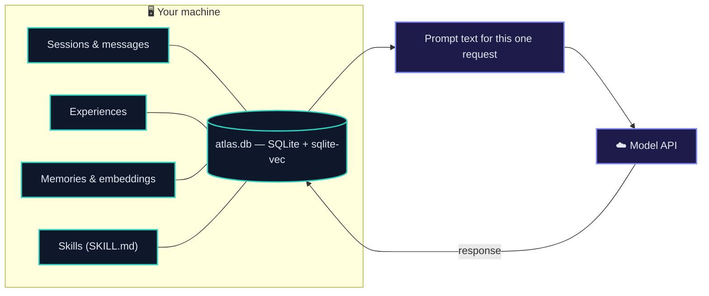
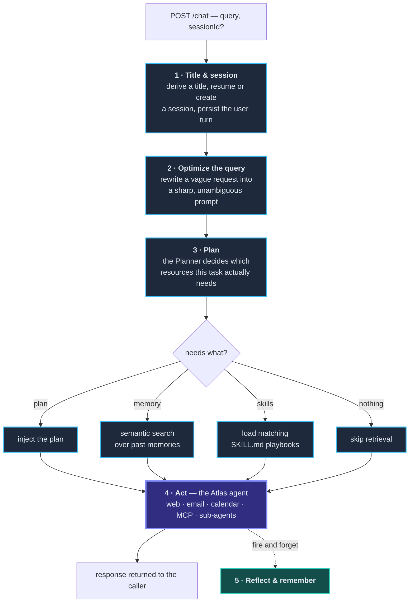
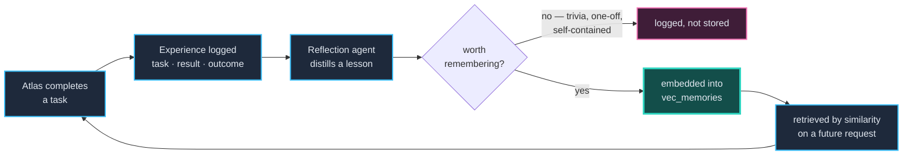

<div align="center">


# Atlas

**An agentic executive assistant that plans before it acts, remembers what it learns, and reflects after every task.**

Everything it knows about you lives in a SQLite file on your own disk.

<br/>

[](https://bun.sh)
[](https://www.typescriptlang.org)
[](https://www.sqlite.org)
[](https://hono.dev)
[](LICENSE)

</div>

---

Most assistants are a single model call wrapped in a prompt. Atlas is a small society of agents with a memory. A request doesn't just hit a model — it flows through a cognitive loop: a **planner** decides what's needed, relevant **memories** and **skills** are retrieved, the **Atlas** agent acts with a full toolbelt, and afterwards a **reflection** pass decides whether anything durable was learned and writes it down.

The result is an assistant that gets sharper the more you use it — backed entirely by a local database that never leaves your machine.

---

## Your data never leaves your machine

This is the part most assistants get wrong. Atlas has no server-side account, no cloud database, and no sync. Your conversations, the lessons it draws from them, and the vectors it searches them by are all rows in a SQLite file you can open, inspect, back up, or delete.



The only thing that crosses the network is the prompt for the request you just made. Nothing is retained remotely, because there is nowhere remote to retain it.

**The trade-off, stated honestly:** Atlas is single-tenant and only runs while your machine does. Background reflection and any future scheduled work happen when the process is up, not around the clock. Cloud sync and proactive scheduling are v2 — and the intent is a thin relay for scheduling and notifications, with the data staying local.

---

## The shape of a request

Everything routes through one endpoint — `POST /chat`. The interesting part is what happens in between. This pipeline lives in [`apps/server/src/routes/chat.ts`](apps/server/src/routes/chat.ts):



Steps 3–4 mean Atlas only pays for planning, retrieval, and skill-loading when the task warrants it. Step 5 runs *after* the response is sent, so reflection never costs the caller latency.

---

## The reflection loop

This is why Atlas improves over time, and it is the part worth understanding.

After every task, a reflection agent sees what was asked and what happened, and decides whether anything durable was learned. **Most of the time the answer is no** — and that judgement is the whole feature.



Retrieval returns the *k* nearest neighbours regardless of quality. If every interaction became a memory, "what's 2+2" would compete for retrieval slots with "prefers short emails, signs off as Soubhik" — and the assistant would get **noisier** with use, not sharper. So the reflection agent returns `worthRemembering: false` for anything self-contained, and only genuine lessons are embedded.

What survives is written to be read out of context, since it will surface next to a future conversation that has nothing to do with the one that produced it:

| | |
|---|---|
| **Stored** | `Prefers very short emails and always signs off as Soubhik. Their manager is Priya.` |
| **Not stored** | `Self-contained arithmetic question; no durable preference or tool behaviour was learned.` |

Each memory carries a `category` (`user`, `project`, `workflow`, `tool`, `fact`), an `importance`, and a `confidence` the agent assigns itself.

---

## Sub-agents

Long or messy work gets delegated. `createSubAgents` spawns a sandboxed agent in its own isolated workspace, with no memory of the calling conversation — only its final result comes back, so intermediate tool calls never clutter the main thread.

| Persona | Capabilities | For |
|---|---|---|
| **`general`** | shell · filesystem · memory · compaction | Broad multi-step work: research, planning, drafting, anything combining several tools |
| **`researcher`** | memory · compaction *(read-only)* | Web research and synthesis across sources. No file or shell access, by construction |

Because Atlas runs on your machine, `general` having shell access is the same trust model as any local dev tool — it is your machine, running your task. This is also precisely why hosting Atlas multi-tenant is not a small change, and part of why it stays local-first.

---

## What Atlas can do today

- **Web research** — quick search, single-page scraping, and deep multi-step agentic research via [Firecrawl](https://firecrawl.dev)
- **Email** — read, draft, and send through **Gmail**, connected as a hosted [MCP](https://modelcontextprotocol.io) server via [Pipedream](https://pipedream.com)
- **Calendar** — create and manage **Google Calendar** events, also over MCP
- **Tool discovery** — enumerate an app's available MCP actions on the fly, before acting
- **Sub-agents** — delegate to a sandboxed `general` or `researcher` agent
- **Persistent memory** — sessions, messages, experiences, and semantically-searchable memories, all in local SQLite
- **Skills** — reusable `SKILL.md` playbooks the planner pulls in for specialised tasks, synced from disk on every boot

---

## The agents

| Agent | Model | Role |
|---|---|---|
| **Atlas** | `gpt-5.5` | The executive assistant. Holds the full toolbelt and produces the user-facing answer. |
| **Planner** | `gpt-5.6-luna` | Runs first. Returns a structured decision: is a plan / memory / skills needed, plus the plan text and skill list. Never answers the user. |
| **Reflection** | `gpt-5.4-mini` | Runs after, in the background. Decides whether a durable lesson exists and writes it as a categorised memory. |

The server makes two direct model calls of its own — a title generator (`gpt-5.4-nano`) and a query optimizer (`gpt-5.6-luna`). Sub-agents run on `gpt-5.4`. Embeddings are `text-embedding-3-small` (1536-dim). Model IDs are set per-agent in their source files and are trivial to swap.

---

## Architecture

A [Bun](https://bun.sh) + [Turborepo](https://turborepo.dev) monorepo. Three pieces do the real work.

```
Atlas/
├── apps/
│   └── server/                    # 🌐 Hono HTTP server — entry point & orchestrator
│       └── src/
│           ├── index.ts           # Hono app, routes, skill sync on boot
│           ├── routes/chat.ts     # the pipeline (plan → retrieve → act → reflect)
│           └── libs/utils.ts      # embed, createMemory, searchMemory, loadSkills, syncSkills
│
├── packages/
│   ├── agents/                    # 🤖 @repo/agents — agents, tools & integrations
│   │   └── src/
│   │       ├── agents/            # main · planner · reflection
│   │       ├── tools/             # webSearch · pipedream · skills · subagents
│   │       └── utils/             # runner · pipedream · firecrawl clients
│   │
│   ├── memory/                    # 🧠 @repo/memory — SQLite + vector persistence (Drizzle)
│   │   └── src/
│   │       ├── schema.ts          # sessions · messages · experiences · skills · memories · jobs
│   │       ├── index.ts           # bun:sqlite + sqlite-vec, PRAGMAs, vec_memories
│   │       └── migrations/        # Drizzle Kit migrations
│   │
│   └── skills/                    # 📚 SKILL.md playbooks
│
├── turbo.json
└── package.json
```

### The memory model

| Table | Holds |
|---|---|
| `sessions` | One conversation — title, timestamps |
| `messages` | Every user and agent turn, in order |
| `experiences` | A whole solved task: what was asked, what happened, the reflection drawn from it |
| `memories` | Distilled reusable lessons, with category, importance and confidence |
| `vec_memories` | The `sqlite-vec` shadow table — 1536-dim embeddings, keyed to `memories.id` |
| `skills` | Registry of `SKILL.md` playbooks on disk, synced at boot |
| `jobs` | Background work (currently reflection runs), for retry and debugging |

`memories` and `vec_memories` are written and deleted as a pair — nothing cascades into a virtual table automatically.

---

## Tech stack

| Area | Technology |
|---|---|
| Runtime & package manager | [Bun](https://bun.sh) |
| Monorepo | [Turborepo](https://turborepo.dev) |
| HTTP server | [Hono](https://hono.dev) |
| Language | [TypeScript](https://www.typescriptlang.org) |
| Agent framework | [`@openai/agents`](https://openai.github.io/openai-agents-js/) |
| Database | [SQLite](https://www.sqlite.org) via `bun:sqlite` |
| ORM & migrations | [Drizzle](https://orm.drizzle.team) |
| Vector search | [`sqlite-vec`](https://github.com/asg017/sqlite-vec) |
| Web research | [Firecrawl](https://firecrawl.dev) |
| App integrations | [Pipedream](https://pipedream.com) + [MCP](https://modelcontextprotocol.io) |
| Schema validation | [Zod](https://zod.dev) |

---

## Getting started

<details>
<summary><b>Prerequisites & installation</b></summary>

<br/>

You'll need [Bun](https://bun.sh) 1.3+ and an [OpenAI API key](https://platform.openai.com). Firecrawl and Pipedream keys are optional — without them, web research and Gmail/Calendar tools are unavailable, but the core loop runs.

```bash
git clone https://github.com/aizen2006/Atlas.git
cd Atlas
bun install
```

</details>

<details>
<summary><b>Environment variables</b></summary>

<br/>

Config is loaded from `process.cwd()`, and the server runs from `apps/server` — so create **`apps/server/.env`** with everything:

```bash
# OpenAI — note BOTH are needed
OPENAI=sk-...                  # read directly by apps/server/src/libs/openai.ts
OPENAI_API_KEY=sk-...          # read by the @openai/agents SDK

# Database — relative to apps/server
DB_FILE_NAME=../../packages/memory/src/memory.db

# Optional — web research
FIRECRAWL_API_KEY=fc-...

# Optional — Gmail & Calendar over MCP
PIPEDREAM_CLIENT_ID=...
PIPEDREAM_CLIENT_SECRET=...
PIPEDREAM_PROJECT_ID=...
PIPEDREAM_ENVIRONMENT=development
PIPEDREAM_USER_ID=...
```

> **Heads up:** these guards run at *import* time, so a missing key fails at startup, not on the first request. `DB_FILE_NAME` is a relative path — running from the wrong directory silently creates a fresh, empty database rather than erroring.

</details>

<details>
<summary><b>Database setup & running</b></summary>

<br/>

```bash
# apply migrations
cd packages/memory
bunx drizzle-kit migrate

# start the server (skills sync automatically on boot)
cd ../../apps/server
bun run dev
```

Then talk to it:

```bash
curl -X POST http://localhost:3000/chat \
  -H "Content-Type: application/json" \
  -d '{"query":"What is on my calendar tomorrow?"}'
```

The response is `{ "sessionId": 1, "response": "..." }`. Pass that `sessionId` back on the next request to continue the conversation.

</details>

---

## Project status

Atlas is a working prototype under active development. What's real, and what isn't:

**Working** — the full plan → retrieve → act → reflect pipeline, semantic memory with quality gating, skill sync and loading, sub-agent delegation, web research, Gmail/Calendar over MCP.

**Not yet** —

- `POST /chat/stream` is an empty stub. `runAgentStream` exists and works but isn't wired to a route, so responses arrive all at once after the full pipeline completes.
- No interface. `POST /chat` via curl is the only way in — the `atlas` CLI and local web UI are the next milestone.
- Single-tenant by design. `PIPEDREAM_USER_ID` is one hardcoded external user; connections are not per-user.
- `packages/ui/` is untouched `create-turbo` scaffold that nothing imports.
- Sub-agents use `UnixLocalSandboxClient`, which is not portable to Windows.

---

## Roadmap

- [x] Planner → retrieve → act pipeline
- [x] Semantic memory over `sqlite-vec`
- [x] Reflection loop with quality gating
- [x] Skill registry synced from disk
- [x] Sandboxed sub-agents
- [x] Gmail & Calendar over MCP
- [ ] `atlas` CLI — boots the local server and opens the UI
- [ ] Local web UI, with the pipeline's decisions made visible
- [ ] Streaming responses (`POST /chat/stream`)
- [ ] Memory decay and consolidation
- [ ] More skills
- [ ] **v2** — optional cloud relay for scheduling and notifications, data still local

---

<div align="center">

**[MIT licensed](LICENSE)** · Built by [Soubhik Halder](https://github.com/aizen2006)

</div>
